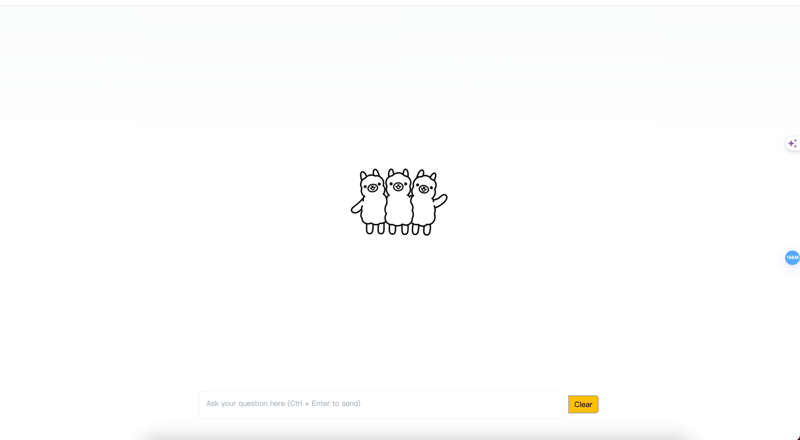

# Introduction
This is a project to test ollama.
[中文](README_ZH.md)
# install
1. install [ollama](https://github.com/ollama/ollama)
2. download llama3
```shell
    ollama run llama3
```
3. download redis
4. Install mysql, create a database named ollama
```shell
create database ollama utf8mb4;
```
5. Write the sql script from the script directory into the database

6. Modify the pkg/config/cfg.toml configuration file and move it to the /etc/ollama-hertz directory
```shell
sudo make -p /etc/ollama-hertz
sudo cp ./script/cfg.tomal /etc/ollama-hertz/cfg.toml
```
7. Start the project, go back to the project root directory, and execute the following command
```shell
go run .
```
8. Open a browser and visit http:127.0.0.1:8080/index.html




# Logo
## Used Ollama's official logo, if it infringes, please contact to remove!!!