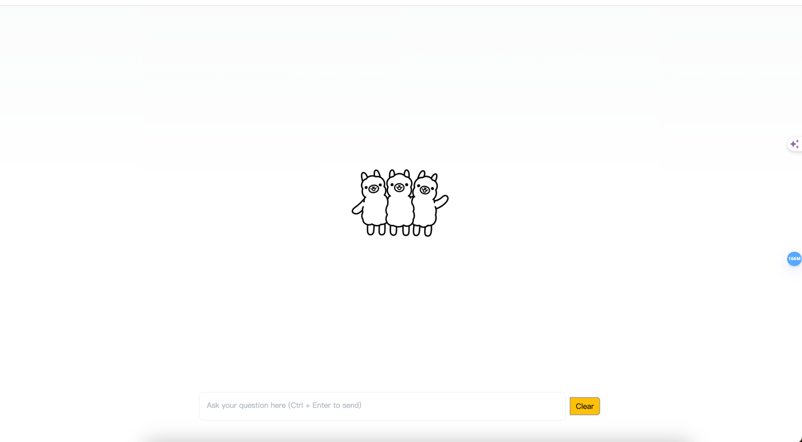

# 简介
这是一个测试ollama的项目

# install
1. 安装[ollama](https://github.com/ollama/ollama), 此处需要科学上网
2. 下载 llama3 此处需要科学上网
```shell
    ollama run llama3
```
3. 安装redis
4. 安装mysql, 创建名为 ollama的数据库 
```shell
create database ollama utf8mb4;
```
5. 把script 下的sql脚本写入数据库中

6. 修改pkg/config/cfg.toml配置文件，并把它移动把 /etc/ollama-hertz目录下
```shell
sudo make -p /etc/ollama-hertz
sudo cp ./script/cfg.tomal /etc/ollama-hertz/cfg.toml
```
7. 启动项目, 回到项目的跟目录，执行以下命令
```shell
go run .
```
8. 打开浏览器访问 http:127.0.0.1:8080/index.html




# Logo
## 使用了Ollama的官方logo, 如果侵权,请联系删除！！！